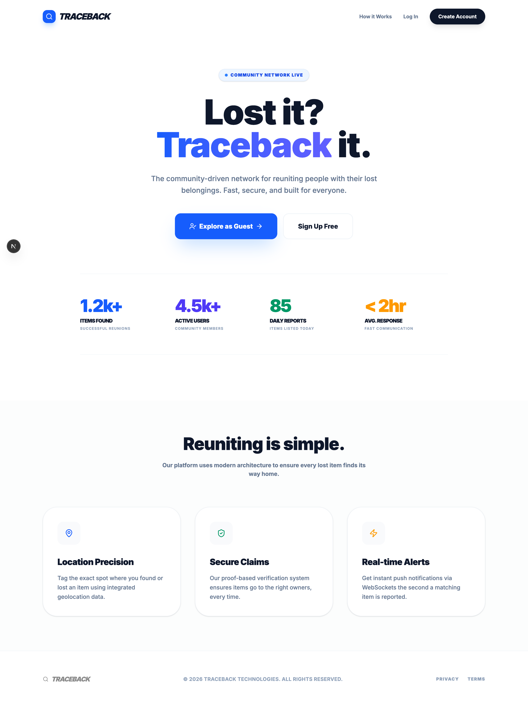
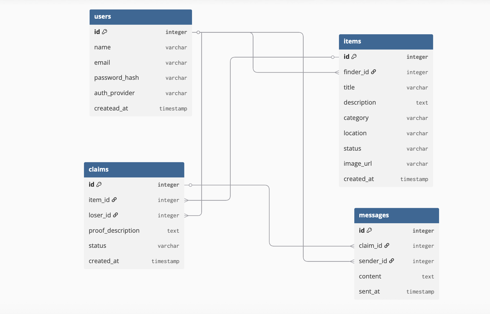

# 🔍 TRACEBACK | Lost & Found Protocol

Traceback is a professional lost-and-found ecosystem that connects finders and losers through secure, real-time verified claims.

---

## 🔗 Project Links
* **Live Application:** [View Live Demo](https://traceback-frontend-one.vercel.app/)

---

## 📸 Project Previews

### 🌐 Landing Page

### 📊 Database Architecture
This schema handles the relationships between Users, Items, Claims, and Real-time Messages.

---

## 🛠️ Tech Stack

### Frontend
- **Framework:** Next.js 15 (App Router)
- **State Management:** TanStack Query (React Query)
- **Styling:** Tailwind CSS
- **Icons:** Lucide React

### Backend
- **Framework:** Spring Boot 3.4
- **Security:** Spring Security & JWT
- **Database:** TiDB (Distributed MySQL)
- **Real-time:** WebSockets (STOMP)
- **Storage:** Cloudinary API

---

## 🚀 Key Features
- **Instant Reporting:** Report lost/found items with image uploads via Cloudinary.
- **Infinite Feed:** Browse discoveries seamlessly with infinite scroll.
- **Secure Claims:** Verification system to ensure items reach the right person.
- **Real-time Chat:** Instant messaging between finder and loser once a claim is initiated.
